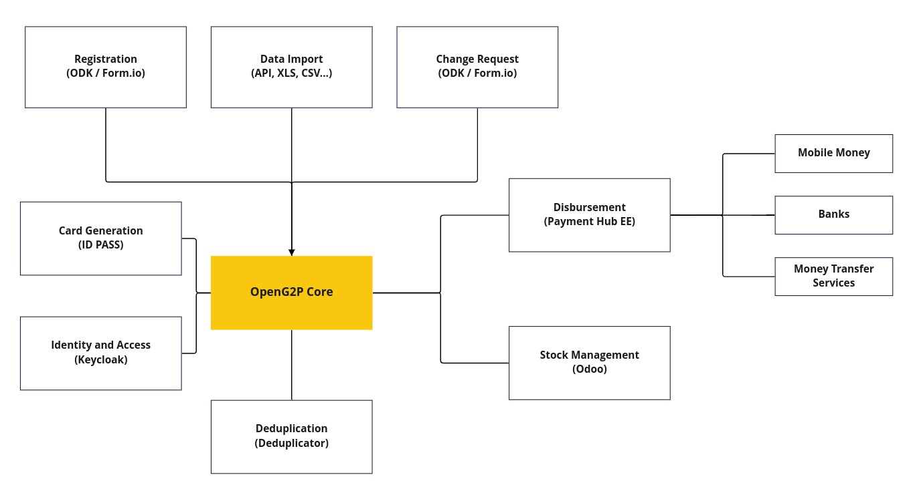
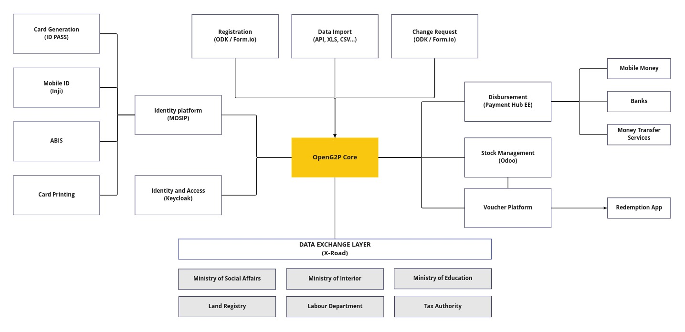

# Architecture

## Functional Architecture

OpenG2P is designed with the registrants at the core of the processes. Registrants then go through processes
defined in the programs and cycles to determine the benefits they are entitled to.

## Modular Architecture

OpenG2P is designed to be used standalone with just the core functionalities or with other components.

The previous diagram shows the core components of OpenG2P. Those components provide APIs that allow you to
replace the default implementation with your own.

For example, the eligibility calculation can be delegated to a third-party service that has access to other
data and just return the eligibility result to OpenG2P.

- [Eligibility Manager](programs/eligibility_manager.rst)
- [Entitlement Manager](programs/entitlement_manager.rst)
- [Deduplication Manager](programs/deduplication_manager.md)
- [Notification Manager](programs/notification_manager.rst)
- [Program Manager](programs/program_manager.rst)
- [Cycle Manager](programs/cycle_manager.rst)

Furthermore, as OpenG2P is based on the ERP Odoo and use the standard models provided by Odoo, you have access
to the thousands of applications available in the [Odoo App Store](https://apps.odoo.com/apps) or build your
[own](https://www.odoo.com/documentation/15.0/developer.html).

### OpenG2P Core

### Example components for a mid-size project

### Example components for a large project

