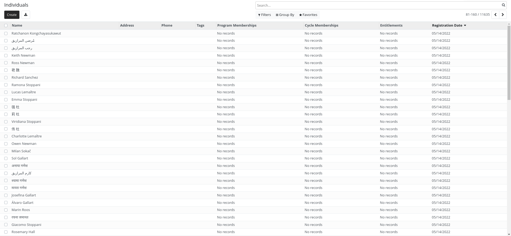
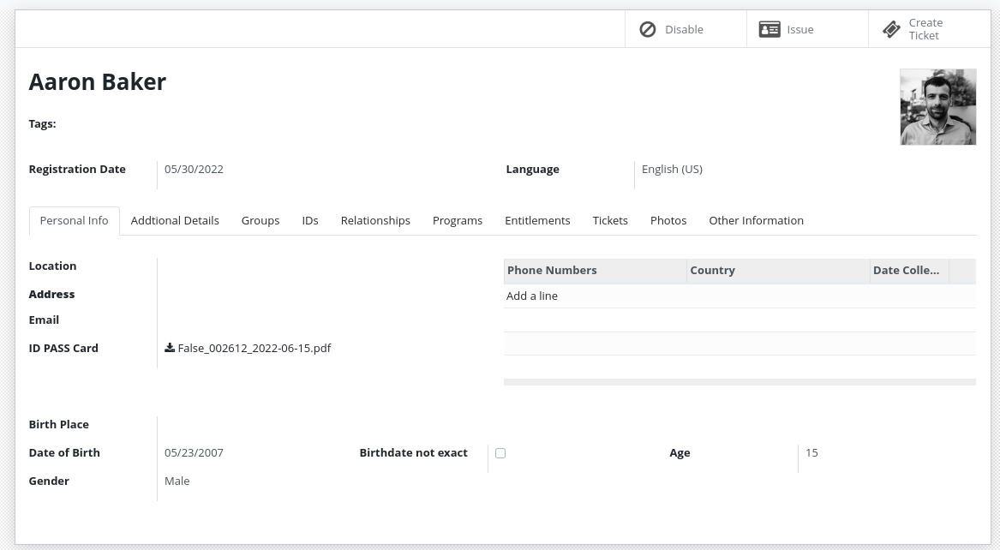
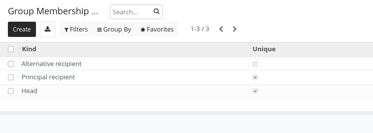
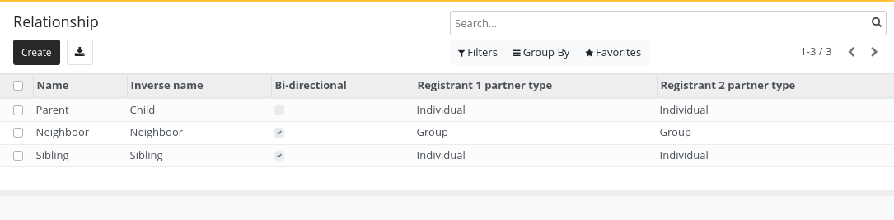

# Concepts

Registrants are at the heart of openG2P.

A registrant can be:

- A `group`
- An `individual`

Depending on the project's requirements, a registrant can simply contain a `name` or full biographic
information, ID document numbers, pictures, bank account numbers, phone numbers and more.

::::{important}

Consider only collecting the data you really need when conducting a project.

See:
[Principles for Digital Development - Address Privacy & Security](https://digitalprinciples.org/principle/address-privacy-security/).

::::

## Individual

An `individual` is a registrant that represents a person. It will have all the fields of a `registrant` plus
some additional ones.

## Group

A group is a `registrant` that represents a set of individuals. It will have all the fields of a `registrant`
plus some additional ones.

For example, groups could represent:

- A household
- A family
- A school
- ...

Groups do not need to contain individuals registrants. They can just contain their number of members.

For example:

- Adults: 2
- Children: 3
- Elderly: 2

## Group membership

Individuals can be part of one or more groups. They can have specific roles in a group.

By default, the following roles exist:

- Head (There can be only one per group)
- Principal recipient (There can be only one per group)
- Alternative recipient

An `admin` has the right to add other roles using the configuration menu.

An individual can be the head of a group but have another or no role in another group.

## Registrants relations

When you need to store the relationship between registrants those relations can be useful.

You can define relationship type between different entities:

- Group - Group
- Individual - Individual
- Individual - Group

For example:

- Sibling (Individual - Individual)
- Parent/Child (Individual - Individual)
- Caretaker (Individual - Group)
- Neighbour (Group - Group)

## ID Documents

Registrants can have one or more ID Document.

The system does not enforce uniqueness of Document ID by default. If uniqueness is required, deduplication
should be performed.

ID Document types can be configured by an admin.
