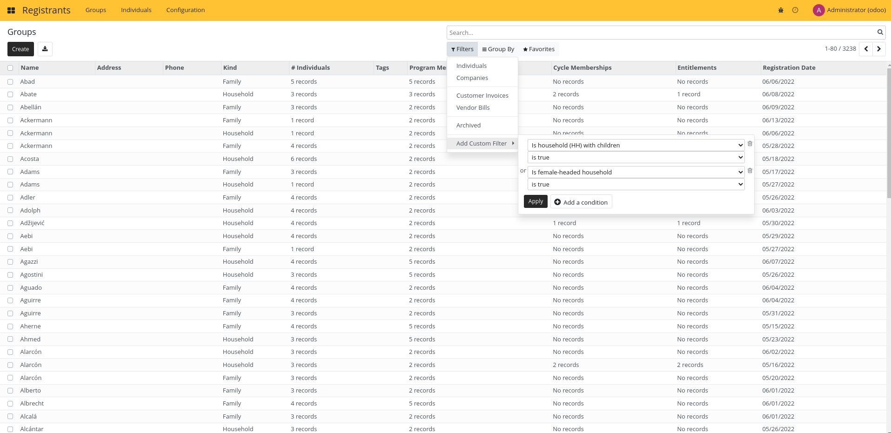
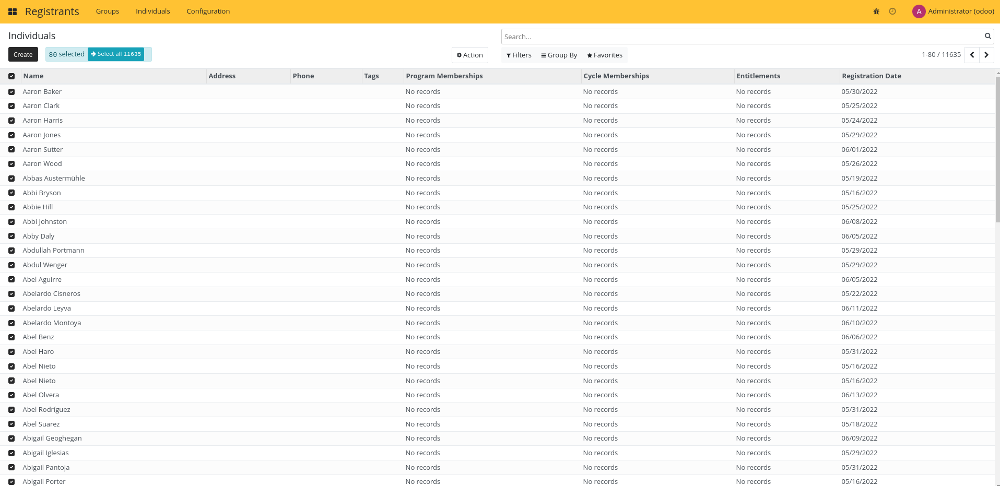
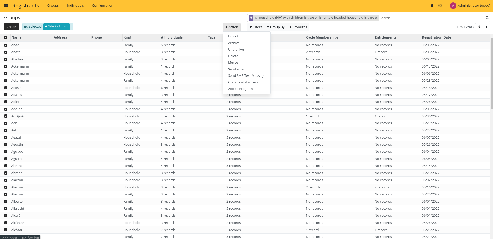

# Exporting Registrants

## Export to Excel or CSV

Group and Individuals can be exported.

Filter the registrants you want to export using the list filtering features.

Select the registrants you want to export.

Click on export from the action menu.

Configure your export. You can create your own export template to make the process faster.

Click on Export, your XLS or CSV export will be downloaded.

To learn more about export capabilities, read the Odoo documentation.
