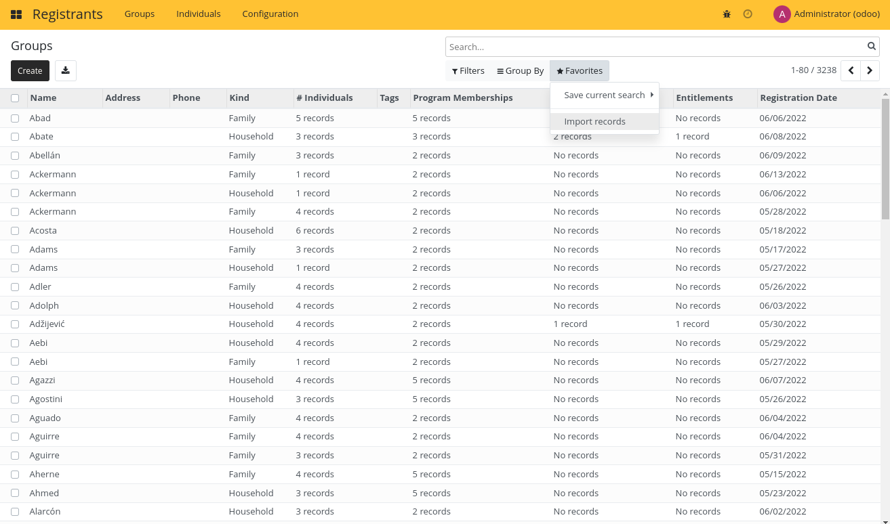
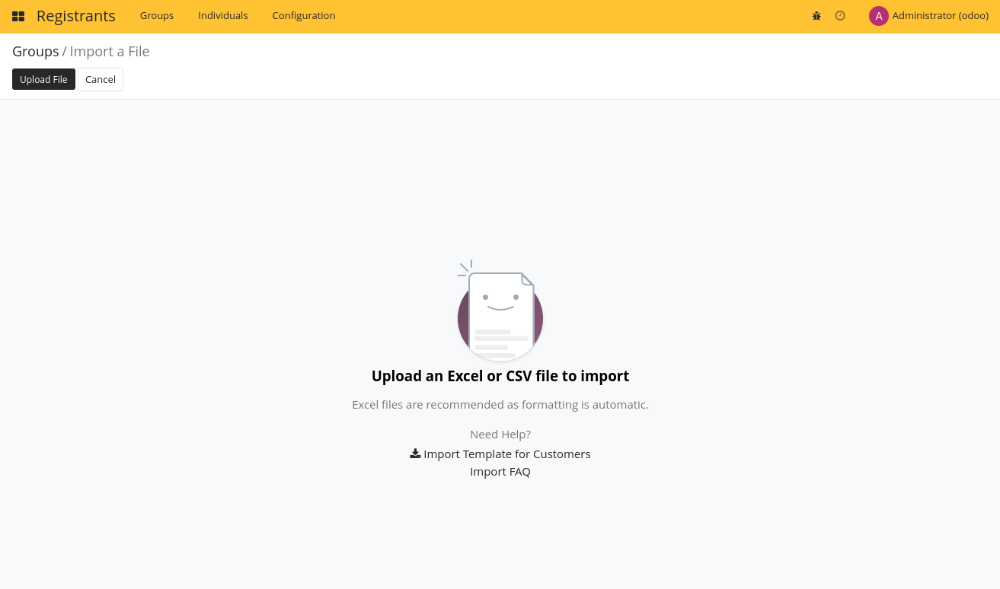
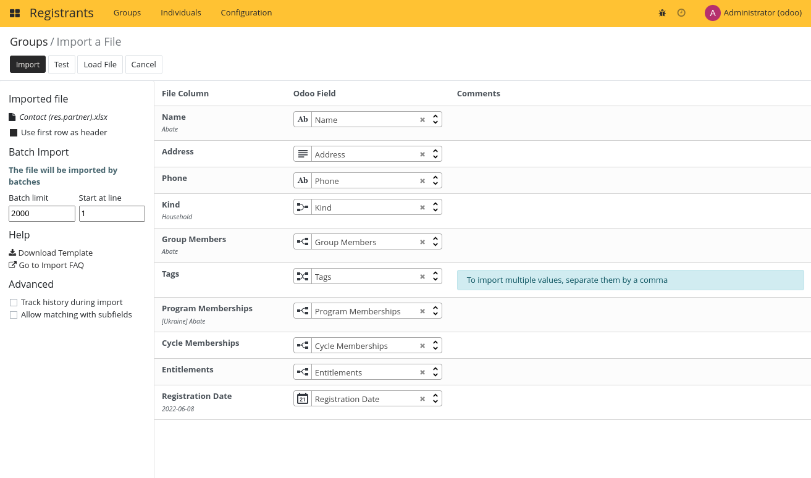
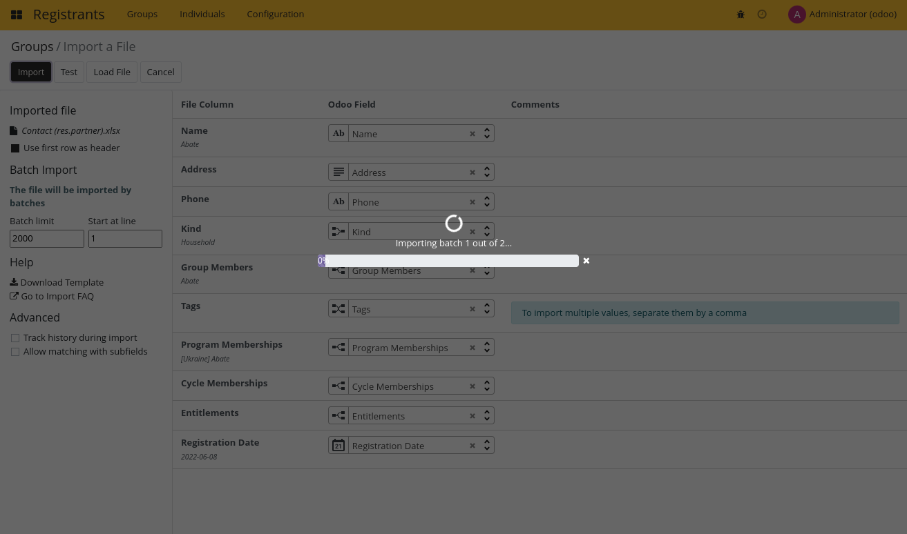
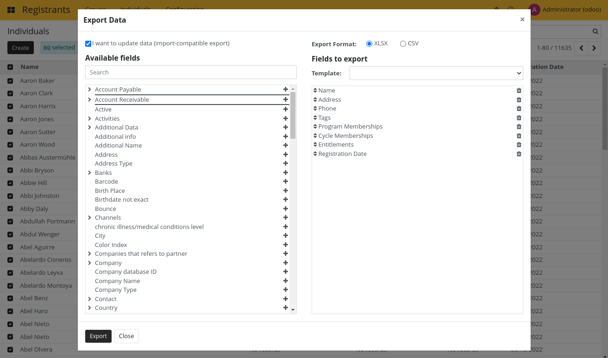

# Importing Registrants

## Import from CSV/Excel

Open the Import records menu.

Upload your import file.

Map the fields in your file to the fields in openG2P.

## Using Import to update data

The import feature is able to update existing data. The easiest way to achieve this is to export the data with
the export feature by enabling the `I want to update data (import-compatible export)`

## Import from ODK Central
